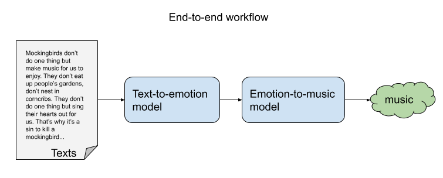
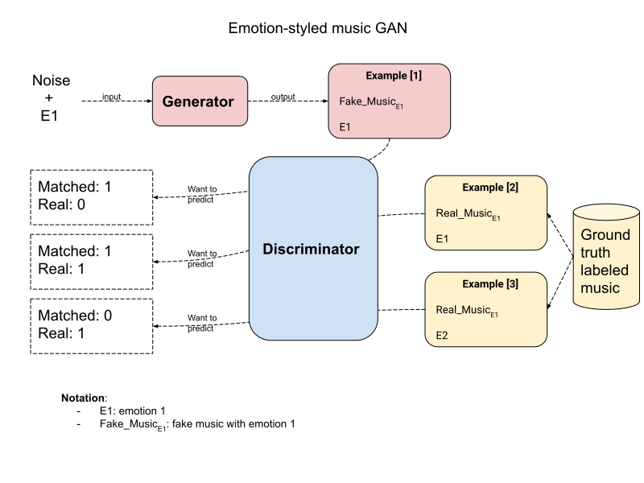
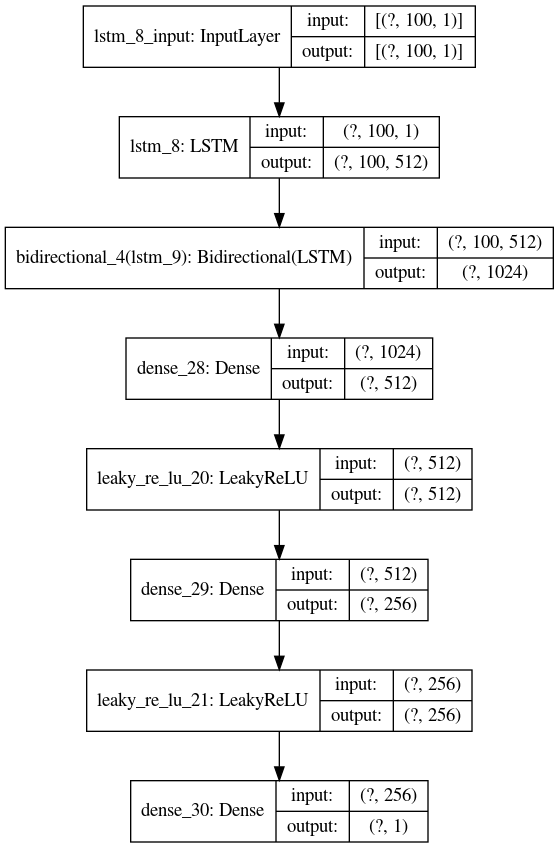
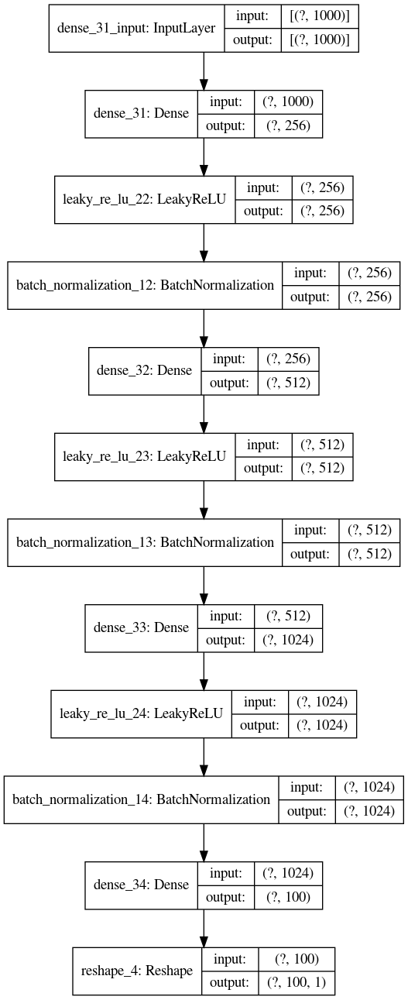

# CS230 Project: Literary Muzak

## Prerequisites

> __Below we assume the working directory is the repository root.__

### Install dependencies

- Create a virtual environment

  ```sh
  conda create -n text_to_music python=3.6
  ```

- Using pip

  ```sh
  # Install the dependencies
  pip install -r requirements.txt
  ```
  
### Train the network

  ```sh
  cd midi-lstm-gan
  python mlp_gan.py
  ```
  After the script ran, it generates 10 songs for each emotions (1 = Sad, 2 = Happy, 3 = Scary, 4 = Peaceful) in the "midi-lstm-gan/results" folder. And it also generates a loss plot by epochs in midi-lstm-gan folder.
  
## Datasets

The initial dataset we used to jump start the emotion to music generation model is [Music and Emotion Datasets](https://doi.org/10.7910/DVN/IFOBRN) from Harvard Dataverse. There are 200 .wav sounds corresponding to the design matrix. The design matrix has a Melody column has 4 categories of emotions for the corresponding music, i.e 1 = Sad, 2 = Happy, 3 = Scary, 4 = Peaceful.

We prepared the datasets by converting all .wav files in one folder to .mid (MIDI) suffix using the following script. The conversion tool it is based on [audio_to_midi_melodia](https://github.com/justinsalamon/audio_to_midi_melodia).  

  ```sh
  # WAV to midi conversion
  cd scripts
  ./wav_to_midi.sh
  ```
  
We also trained the model based on the other datasets without emotion label:
1) [Pokemon music](https://github.com/corynguyen19/midi-lstm-gan/tree/master/Pokemon%20MIDIs) - 307 Songs
   We mark the songs from Pokemon collection as "Happy" 
2) [Pop music](https://github.com/burliEnterprises/tensorflow-music-generator/tree/master/Pop_Music_Midi) - 88 Songs
3) [Final Fantasy music](https://github.com/Skuldur/Classical-Piano-Composer/tree/master/midi_songs) - 92 Songs
  
## End-to-end workflow



## Text to emotion

Our current text to emotion model is based on [Multi-class Emotion Classification for Short Texts](https://github.com/tlkh/text-emotion-classification). The model uses "multi-channel" combinations of convolutional kernels (ala CNN) and Long Short-Term Memory (LSTM) units to classify short text sequences (in our case, tweets) into one of five emotional classes, as opposed to the typical binary (positive/negative) or ternary (positive/negative/neutral) classes. 

The model performance achieved a positive result by achieving more than 62% overall classification accuracy and precision. In particular, they have achieved good validation accuracy on happy, sad, hate and anger (91% precision!) classes.

We will improve the model performamce in the context of music as the future work. We are planning to use music lyrics to train the model as well.

## Emotion to music 



We train a C-GAN (Conditional GAN):
- Generator, with inputs an emotion E and white noise WN, will learn to generate emotion-styled music M from tweaking the noise, to fool the Discriminator into thinking it's real music with the emotion it claims to have.
- Discriminator, with input music M and emotion label E, will learn to tell two things:
  - Whether the music is real or fake.
  - Whether the emotion E matches the emotion from music M.
  
## Discriminator Architecture


## Generator Architecture


## Sample Songs

Bad Examples: 
- We first encoded the emotions as a large portion (50%) of the note sequence in the Train_X input the song came out with many repetitve notes.
[song1](https://onlinesequencer.net/import2/854172a939744584b7cdf073df60ea63?title=gan_final_3.mid). 

Better Examples:
- We encoded the emotions as 10% of the note sequence. 
Here are example:
[happy song](https://onlinesequencer.net/import2/d35e7e219d936ebbff266151656544e4?title=gan_final_2_1.mid)
[sad song](https://onlinesequencer.net/import2/33d9c83a774a4d04b9ad76c809e1e42c?title=gan_final_1_1.mid)
[scary song](https://onlinesequencer.net/import2/bcc74e54c830ce216c1a3287d008cf34?title=gan_final_3_3.mid)
[peaceful song](https://onlinesequencer.net/import2/41522b8f7b82e44742c3c7d8a1532cea?title=gan_final_4_9.mid)

